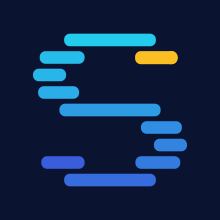

<h1 align="center">
  <br />
  Setiv
</h1>

<p align="center">
  <b>S</b>AT <b>E</b>vent <b>T</b>racer and <b>I</b>nteractive <b>V</b>iewer<br />
  <a href="https://setiv.pages.dev/">setiv.pages.dev</a>
</p>


## Overview

| Path                          | Contents                                                                                   |
| ----------------------------- | ------------------------------------------------------------------------------------------ |
| `event_protocol/`             | The protocol spec, JSON schemas, log generation scripts              |
| `solvers/`                    | `cadical`, `minisat`, `satch` and `setiv-dpll` all patched and written to implement the protocol |
| `formulas/`                   | DIMACS instances used for testing              |
| `web/`                        | The viewer, a preact+vite app                                                    |

## Setup

To run the viewer locally:

```bash
cd web
npx install
npx run dev
```

To build solvers:

```bash
# build solvers local
solvers/build.py
# generate log
event_protocol/run_eventlog.py [solver] formulas/php_4_3.cnf
```

Logs land in `event_protocol/out/`.

### The event protocol

In NDJSON/JSONL format:

```json
{"event":"decide","literal":11,"level":1,"heuristic":"vmtf"}
{"event":"propagate","literal":10,"level":1,"reason_clause_id":9}
{"event":"conflict","clause_id":10,"literals":[-10,-11],"level":1,"trail":[11,10]}
{"event":"learn","learned_literals":[-11],"glue":0,"clause_id":-1,"jump_level":0}
{"event":"backtrack","from_level":1,"to_level":0,"kind":"conflict","reason":"analyze"}
```

The specification defines the shape of the events, how the viewer expects them. 
Since the protocol is designed to be decoupled from a specific solver, 
the decisions on when and how these events are emitted is up to the implementation
of an adapter. 

See 

- [`event_protocol/solver_event_protocol.md`](event_protocol/solver_event_protocol.md) for the full specification and details on how to implement the protocol for a solver.
- [`event_protocol/json_schemas/solver_event_schema.json`](event_protocol/json_schemas/solver_event_schema.json) for a json schema to validate against.


Reference implementations:

- [`solvers/setiv-dpll`](solvers/setiv-dpll), an around 300 lines textbook DPLL solver 
without optimizations. Does not emit all events, because either they are not relevant 
to pure DPLL (e.g. `learn`) or the solver does not implement this behavior (e.g. `restart`). 
- [`solvers/cadical`](https://github.com/KaindlJulian/cadical/tree/event_logger_hooks), a fork of CaDiCaL with the hooks in `src/hooks.cpp`
  and an abstract `SolverObserver`, to seperate the hook logic and the JSON writing.
